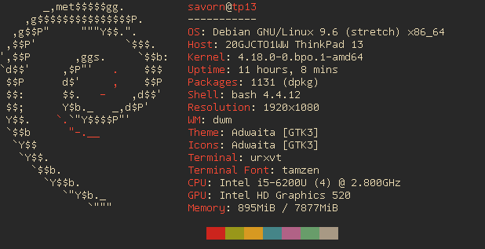

# Savorn's dotfiles

Fetched system info using [neofetch](https://github.com/dylanaraps/neofetch)

## What are dotfiles?
Dotfiles are configuration files for unix-like OS/distro (debian, ubuntu, macOS, openBSD, etc). 
They are called dotfiles because the files are usually preceded with a dot (e.g. .vimrc, .bashrc, .xinitrc) or 
the folders are usually preceded with a dot (e.g. /home/savorn/.config). This repository keep track of changes to 
my dotfiles as well as other system configurations. You are free to fork my dotfiles for your personal use, however I 
am not responsible for any damages.

## License

[Unlicense.org](http://unlicense.org/)

[Savorn Meuk](https://github.com/savorn) has waived all copyright. Anyone is free to copy, modify, publish, use, compile, sell, or
distribute this software, either in source code form or as a compiled
binary, for any purpose, commercial or non-commercial, and by any
means.
